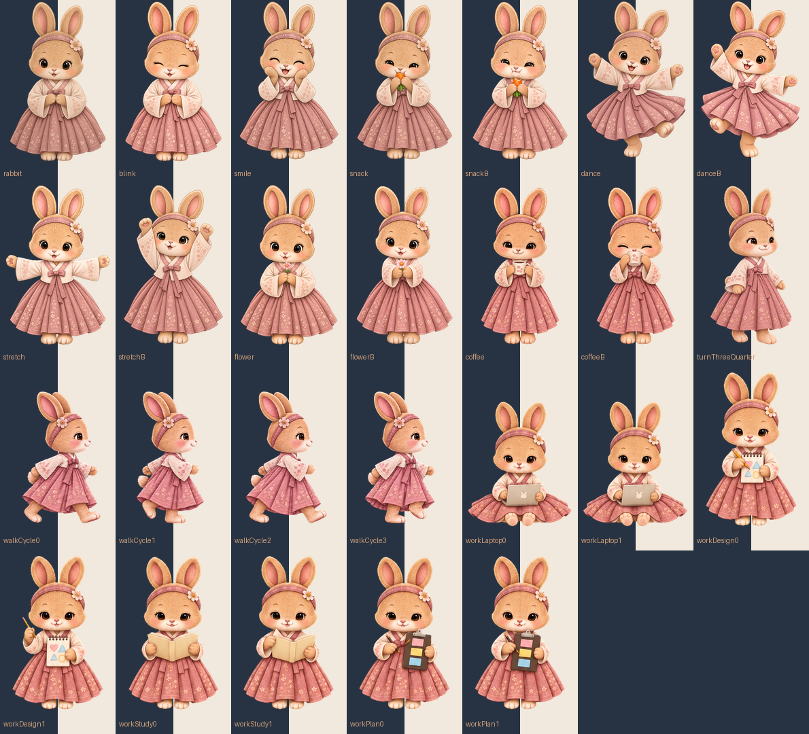

# 달토끼 · Moon Rabbit

[English](README.en.md)

한복 입은 갈색 토끼가 작업하는 동안 곁을 지켜주는 macOS 데스크톱 펫입니다.



## 실행

macOS 13 이상. 첨부한 `MoonRabbit-macOS.zip`은 Apple Silicon Mac용입니다. 압축을 풀고 `MoonRabbit.app`을 실행하세요. 소스 빌드는 Xcode 또는 Swift 5.9 이상 개발 도구가 필요합니다. 기본 기능은 외부 패키지나 자체 서버 없이 동작합니다. 날씨 기능은 인터넷과 Open-Meteo API를 사용합니다.

```sh
./scripts/build-app.sh
open dist/MoonRabbit.app
```

앱을 실행하거나 메뉴 막대의 **☾**를 누르면 하루 플래너가 열립니다. **토끼 오른쪽 클릭**으로 작은 설정창을 엽니다. **왼쪽 클릭**은 간식·웃기·춤·스트레칭·꽃·오늘 일정·날씨·설정의 빠른 메뉴를 엽니다. 설정창은 제목줄을 잡고 자유롭게 옮길 수 있고, 위치가 저장됩니다. 이전 버전이 켜져 있으면 **종료** 후 새 앱을 여세요.

## 펫과 놀기

- **커서 올리기:** 웃거나 꽃을 건네며 반응합니다. 클릭하기 쉽도록 잠깐 이동을 멈춥니다.
- **왼쪽 클릭:** 빠른 메뉴. **오른쪽 클릭:** 설정창. **드래그:** 토끼의 위치나 모니터를 바꿉니다.
- **산책하기 / 한자리에 있기:** 부드럽게 출발·감속하고 도착하면 쉬는 산책, 또는 제자리 유지.
- **크기:** 60~160%. 다음 실행 때도 유지됩니다.
- **간식 / 웃기 / 춤 / 스트레칭 / 꽃 주기:** 버튼으로 행동을 선택합니다. 가만히 두어도 무작위로 행동합니다.
- 걷기·춤·간식·스트레칭·꽃 건네기는 서로 다른 손발·팔 자세를 이어 보여줍니다. 쉬고 있을 때 3~7초 간격으로 눈을 깜빡입니다.
- 13개 투명 PNG 자세와 호흡·회전·점프·부드러운 화면 이동을 조합한 2D 애니메이션입니다. 한국어와 영어로 각각 40개 상황별 멘트를 담았습니다.

## 저장·목표 표시·하루 플래너

- 설정의 **저장** 버튼은 목표·말풍선 표시·크기·이동·언어·타이머 설정을 보관하고 “저장됨”을 표시합니다. 기존 설정의 즉시 적용·자동 저장도 유지됩니다.
- **말풍선에 목표 표시**를 켜면 말풍선 위쪽에 목표가 계속 표시되고 아래쪽에는 토끼의 멘트가 나옵니다. 긴 목표는 줄여 표시하며 전체 내용은 설정에서 확인합니다.
- 설정의 **하루 플래너** 또는 왼쪽 클릭 메뉴의 **플래너**을 엽니다.
- 날짜를 고르고 **+ 일정 추가**로 시간·분류·할 일·예정 분량(분)을 적습니다. 체크로 완료 표시, −로 항목 삭제, **저장**으로 날짜별 보관을 할 수 있습니다.
- 날짜별 메모와 집중 시간, 10분 단위 하루 시간표를 제공합니다. 시간표의 시각을 누르면 그 시간의 일정을 추가합니다. 일별 집중 시간은 이 버전부터 기록합니다.
- 디데이의 이름과 날짜를 정하고 표시 스위치를 켜면 말풍선 위에 D−일수, 당일 D-DAY, 지난 날짜 D+일수를 표시합니다. **하루 저장**으로 목표·디데이·일정·메모를 함께 저장합니다.
- 크림색과 세이지색의 독자적인 플래너 디자인이며 참고 이미지는 앱에 포함하지 않았습니다.
- 일정 창을 열면 오늘의 미완료 일정 중 앞의 3개를 말풍선으로 알려줍니다. 외부 캘린더와 자동 동기화하지 않습니다.

## 날씨

왼쪽 클릭 → **날씨** → 도시 검색 → 검색 결과에서 원하는 도시 선택. 현재 기온·체감 기온·날씨 상태·풍속과 제공 시각을 보여주고 말풍선으로도 알려줍니다. 다음에 날씨 창을 열면 마지막 선택 도시를 새로 조회합니다. 연결 실패 시 오류를 표시하고 재시도할 수 있습니다.

날씨 조회에만 도시 이름·선택한 도시 좌표를 사용합니다. 목표와 일정은 전송하지 않으며 GPS 권한을 요청하지 않습니다. 출처: [Open-Meteo Weather API](https://open-meteo.com/en/docs), [Geocoding / GeoNames](https://open-meteo.com/en/docs/geocoding-api).

## 목표와 시간

1. **오늘의 목표**를 입력합니다. 목표는 이 Mac에 보관됩니다.
2. **작업 시간**은 누적 스톱워치입니다. 누적 1시간마다 토끼가 말풍선으로 알려줍니다.
3. **카운트다운**은 원하는 분 수를 입력하거나 25분·50분을 고릅니다. 1~720분을 지원합니다.
4. **시작 / 일시정지**를 사용합니다. 카운트다운이 끝나면 소리와 목표를 담은 말풍선으로 알려주고 멈춥니다. 숨겨 둔 펫도 완료 시 다시 표시됩니다.
5. 카운트다운 **초기화**는 설정한 시간으로 돌아가며 누적 작업 시간은 보존합니다. 스톱워치 **초기화**는 누적 시간을 지웁니다. 두 경우 모두 확인창을 표시합니다.

작업 시간·카운트다운은 화면 잠금·잠자기 때 일시정지됩니다. 다시 작업할 때 직접 **시작**을 누르세요. 앱을 종료했다 켜도 시간을 복원하며 일시정지 상태로 시작합니다. 누적 시간은 날짜가 바뀌어도 자동 초기화되지 않습니다.

언어 설정에서 **한국어 / English**를 고르면 설정·멘트·알림이 함께 바뀝니다. 입력한 목표는 번역하지 않습니다.

키보드 입력이나 다른 앱의 활동을 감시하지 않습니다. 자리 비움은 직접 일시정지해 주세요. 시간은 10초마다 저장하므로 강제 종료하면 마지막 최대 10초가 누락될 수 있습니다.

## 개발·검증

```sh
swift test --disable-sandbox
swift run --disable-sandbox
./scripts/build-app.sh
```

테스트는 타이머 일시정지·완료 중복 방지·복원·초기화, 산책 경계·감속·정지, 멘트 중복 방지, 영문 멘트, 모든 자세의 투명 배경, 플래너 직렬화·날짜 구분·완료 항목, 날씨 URL 인코딩과 응답 해석을 확인합니다. GitHub Actions에서도 테스트와 앱 ZIP 빌드를 수행합니다.

코드는 Swift/AppKit/SwiftUI입니다. `WorkClock.swift`, `FocusTimer.swift`, `PetBehavior.swift`, `Localization.swift`가 각각 시간·카운트다운·행동·번역을 담당합니다. Windows는 Electron(JavaScript) 버전, iPad는 SwiftUI + WKWebView 버전을 별도로 제공합니다. 자세한 빌드 방법과 검증 상태는 `windows/README.md`, `ipad/README.md`를 참고하세요. Android 앱은 아직 제공하지 않습니다. 앱은 로컬 ad-hoc 서명이며 Apple 공증 배포본이 아닙니다. 다른 Mac에서는 소스로 빌드할 수 있습니다.

## 무료 사용과 공개

앱 사용에는 ChatGPT 구독이나 유료 서버가 필요하지 않습니다. 코드: [MIT](LICENSE).
그림: [별도 무상 이용 허락](ARTWORK-LICENSE.md). AI 생성 과정을 [ARTWORK.md](ARTWORK.md)에 기록했습니다.
날씨는 비상업 무료 API 조건이 적용됩니다. [외부 서비스](THIRD-PARTY-NOTICES.md),
[개인정보](PRIVACY.md), [공개 검토와 한계](RELEASE-REVIEW.md)를 확인하세요.

## 나만의 플래너

상단 이름 옆 **연필 버튼**에서 플래너 이름을 변경합니다. 즉시 저장되며 기본 이름으로 돌아갈 수 있습니다.
**오늘의 목표·이달의 목표**를 큰 글씨로 함께 표시하고, **플래너 모드**는 일곱 개의 선택 버튼으로 제공합니다.
월간 화면의 목표는 일간 화면의 이달 목표와 같은 기록을 사용합니다.

플래너 상단의 팔레트 버튼에서 제목·디데이 영역 제목·디데이 표시 문구와 플래너 배경/카드/강조색, 말풍선 배경/테두리를 직접 지정합니다. 색상은 즉시 적용·보관되며 글자색은 배경 밝기에 맞춰 바뀝니다. 시작 시각 메뉴와 예정 시간 조절은 10분 단위입니다. 기존 일정의 시각은 유지됩니다.

플래너의 **시간 선택 간격**에서 10분/30분을 고르세요. 시작 시각이나 예정 분량 버튼을 누르면 스크롤 목록이 열립니다. 휠·트랙패드로 내려 원하는 값을 클릭하세요. 간격을 바꿔도 이미 적은 일정은 바뀌지 않고, 새로 선택하는 값에만 적용됩니다.

기본 플래너 제목은 **달토끼 플래너**, 시간표 이름은 **하루 일정**입니다. 10분/30분 선택에 따라 시간표 칸도 바뀌며, 칸을 누르면 해당 시각의 일정이 추가됩니다. 날씨는 한글·영문 도시와 동네 주소를 검색합니다(예: 서울 연남동, 부산 우동, 제주 애월읍). 주소를 확인해 지역을 선택하세요. 동네 검색은 Photon/OpenStreetMap을 사용하고 도시 검색은 GeoNames로 보완하며, 선택 좌표의 예보는 Open-Meteo에서 받습니다. 동네 검색 결과와 날씨 제공 격자의 해상도는 다를 수 있습니다.

일정 행 왼쪽의 색상 버튼으로 각 일정의 색을 지정합니다. 시간이 겹치는 일정은 목록에서 먼저 나온 일정의 색을 표시합니다. **☕ 커피**는 잔을 들고 마시는 두 자세를 번갈아 보여줍니다. 바탕화면의 달토끼.app 바로가기는 최신 dist/MoonRabbit.app을 가리킵니다.

동네 검색: [Photon](https://github.com/komoot/photon), 지도 데이터: [© OpenStreetMap contributors](https://www.openstreetmap.org/copyright). 검색 버튼을 누를 때만 요청하며 반복 검색은 메모리 캐시를 사용합니다. 공개 데모 서버는 대규모 배포 시 별도 운영 서버로 교체해야 하며 가용성 보장은 없습니다.

## 직군별 도구와 자율 산책

플래너의 **직군별 작업 도구**를 펼치면 개발자·디자이너·기획자·수험생·회사원 도구를 선택할 수 있습니다. 각 날짜와 직군의 메모·체크리스트를 따로 보관합니다. 개발자는 재현·원인·다음 작업, 디자이너는 목적·참고·피드백과 색상 팔레트, 기획자는 문제·결정·위험, 수험생은 공부·오답과 과목별 예정/완료 분량, 회사원은 회의·결정·담당자/기한을 정리합니다. 체크리스트를 일정에 추가하거나 25/50분 집중을 바로 시작할 수 있습니다. 완료 분량은 체크한 일정의 예정 시간이며 실제 과목별 측정 시간과 다릅니다.

산책은 설정창이 열려 있어도 스스로 목적지를 골라 현재 모니터 안에서 좌우로 이동하고 3~8초 쉬었다가 다시 걷습니다. 오른쪽으로 걷는 옆모습 두 자세를 만들고 왼쪽 이동 시 반전합니다. 커서를 올리거나 메뉴를 누르거나 드래그하면 이동을 잠시 멈춥니다. 한자리에 있기를 선택하면 이동하지 않습니다.

**오늘 날씨**는 저장된 지역을 바로 조회해 말풍선에 약 15초 표시한 뒤 평소 응원 멘트로 돌아옵니다. 지역 변경은 **날씨 지역 설정**을 사용하세요. 커피 두 자세는 치마 끝까지 다시 그려 투명 여백을 확보했습니다. 시간표 가로축은 선택한 10/30분 단위에 맞춰 분 표시를 바꿉니다.

## 플래너 모드·월간 보기·알람

상단 **플래너 모드**에서 개발자·디자이너·기획자·1인 스타트업·학생·회사원·스타트업 팀을 선택합니다. 모드별 일정과 작업 노트가 분리되며 기존 일정은 이전에 선택했던 모드에서 유지됩니다. 개발은 모듈/검증, 디자인은 화면/팔레트, 기획은 요구사항/의사결정, 1인 스타트업은 고객 실험/지표, 학생은 과목/복습, 회사원은 업무/담당자, 팀은 프로젝트/담당자/미배정 업무에 맞춥니다. 팀 모드는 이 Mac에서의 업무 정리용이며 실시간 공동 편집은 없습니다.

**월간 →** 버튼으로 월간 달력을 열고 날짜를 누르면 간편 일정 입력창이 열립니다. 시작일과 1주일·1개월·100일·200일·1년을 선택하며 종료일은 포함 기준입니다. 월간 달력에는 선택한 모드의 일정과 색상이 표시됩니다.

상단 **알람 아이콘**에서 날짜·스크롤 시간·메모·매일 반복을 설정합니다. 앱 실행 중 소리와 25초 말풍선으로 알려주고, 잠자기 중 지난 알람은 깨어나면 한 번만 표시합니다. 앱 종료 중에는 울리지 않으며 재실행 시 지난 활성 알람을 한 번 알립니다.

토끼의 얼굴과 한복은 유지합니다. 직업별로 노트북·디자인북·책·계획 보드 소품을 들고 작업합니다. 성숙한 체형과 직업복으로 만든 시안은 포함하지 않습니다. 걷기는 이동 거리와 연동한 4프레임으로 바꾸고, 앞모습에서 옆모습 사이에 비스듬한 자세를 넣었습니다. 커피 자세의 빈 여백을 줄여 크기 차이를 보정했습니다.

## 월간 기록과 가독성

월간 화면에서 이번 달 목표·메모·할 일을 직접 입력하고 완료 체크를 할 수 있습니다. 월과 직업 모드별로 따로 저장하며 **월간 저장**으로 보관합니다. 달력 날짜를 누르면 간편 일정 입력창이 열리고, 입력 내용은 해당 날짜의 일간 일정과 함께 반영됩니다. 자세한 시간과 분류는 **일간 자세히**에서 편집합니다. 플래너 본문/입력 글자는 13~14pt, 달력 날짜는 16pt로 키웠고 시간표 너비와 색칠 칸, 완료 체크 영역도 넓혔습니다.

걷기·방향 전환·책 보기·직업별 작업·커피 자세의 털과 한복 색감을 기본 토끼의 따뜻한 갈색과 차분한 분홍색에 맞췄습니다.


## 최신 추가 기능

- 제목 옆 로고를 눌러 기본 이미지·리본·하트·연필·스마일·토끼 실루엣·별·체크 표시 선택 및 저장.
- 날짜 확대, 창 모서리로 크기 조절, 플래너 확대/축소 75–140%. iPad에서는 앱 안의 표시 배율을 조절합니다.
- 일정 우선순위 높음/보통/낮음. 시간표에 커서를 올리면 상세 내용이 표시됩니다.
- 선택한 모드의 미완료 일정 시작 60/30/10분 전 말풍선 알림. 같은 알림 중복 방지 및 자정 넘는 일정 지원.
- 점심/저녁 메뉴 2–3개 입력 후 룰렛 선택. 후보 저장 및 토끼의 결과 안내.

말풍선 알림은 앱이 실행 중이고 기기가 깨어 있을 때 동작합니다. iPad는 앱이 화면에 열려 있어야 합니다.
닫힌 앱을 깨우는 시스템 푸시 알림은 포함하지 않습니다. 지난 알림을 한꺼번에 재생하지 않으며, 알림 시각으로부터 1분 내에만 표시합니다.
Windows/iPad는 새 포트이며 실제 실행 검증 결과는 각 플랫폼의 TESTING 문서 및 GitHub Actions를 확인하세요.

기본 포인트 색상: 사용자 지정 핑크 `#EE68C0`. 기존 사용자 색상은 유지됩니다.

일간·주간·월간 목표 막대는 선택한 직군의 완료한 일정 수를 집계합니다. 주간은 월요일부터 일요일까지입니다. 각 목표치(기본 3/15/60개)와 막대 색을 따로 바꿀 수 있습니다. 넓은 창은 목표·메모 왼쪽, 시간표 오른쪽의 다이어리 배치이며 좁은 창은 세로로 펼쳐집니다.

### 무료 에이전트 작업실과 주간 화면

일간·주간·월간·에이전트 버튼으로 전환합니다. 이름 옆에 오늘·이달 목표를 적고, 하루 시간표 위에서 디데이를 관리합니다. 작업실에서는 역할 분담과 작업 순서를 정리하고, 선택한 날의 일정을 가져와 지시문을 복사할 수 있습니다. ChatGPT/Codex/Gemini/Claude 열기는 웹 서비스 링크이며 직접 붙여넣고 전송해야 합니다. 기본 플래너는 무료이며 구독을 요구하지 않습니다. 선택 기능인 개인 API 전송은 본인 제공자 계정에 별도 과금될 수 있습니다. 외부 AI 서비스 이용 조건은 각 계정에 따릅니다. [기능 필요성 및 유사 도구 비교](AGENT-STUDIO-REVIEW.md).

주간 목표는 월요일을 기준으로 주차·직업 모드별 저장합니다. 에이전트 작업실은 편집 가능한 단계·하부 카테고리·사무실 배치도·전체 구조도를 제공합니다.

상위 메뉴는 **일관리 / 생활관리**로 나뉩니다. 생활관리는 식사·수면·운동·휴식·취미·모임을 날짜별로 기록합니다. 행사·시험 기간은 날짜 범위와 배경색을 등록·편집·삭제할 수 있습니다. 개인 API는 설치 앱에서만 안전하게 설정할 수 있으며 웹 미리보기는 복사·서비스 열기를 제공합니다.
